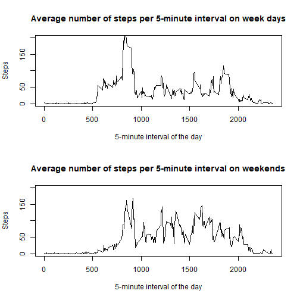

Course Project 1
================

#Assignment
From Coursera - Reproducible Research by John Hopkins University, [Course Project 1](https://www.coursera.org/learn/reproducible-research/peer/gYyPt/course-project-1)  

It is now possible to collect a large amount of data about personal movement using activity monitoring devices such as a Fitbit, Nike Fuelband, or Jawbone Up. These type of devices are part of the “quantified self” movement – a group of enthusiasts who take measurements about themselves regularly to improve their health, to find patterns in their behavior, or because they are tech geeks. But these data remain under-utilized both because the raw data are hard to obtain and there is a lack of statistical methods and software for processing and interpreting the data.  

This assignment makes use of data from a personal activity monitoring device. This device collects data at 5 minute intervals through out the day. The data consists of two months of data from an anonymous individual collected during the months of October and November, 2012 and include the number of steps taken in 5 minute intervals each day.  

##Analysis
We start by making sure we have the libraries we will need.

```r
library(dplyr)
library(ggplot2)
```

Let's read the dataframe from the internet.  

```r
theUrl <- "https://d396qusza40orc.cloudfront.net/repdata%2Fdata%2Factivity.zip"
fname <- "activity.csv"
tempFile <- tempfile()
download.file(theUrl, tempFile)
unzip(tempFile, "activity.csv")
df <- read.csv(file=fname, sep=",")
```
Let's have a look at the dataframe. The dimensions:

```r
dim(df)
```

```
## [1] 17568     3
```
Column names:

```r
names(df)
```

```
## [1] "steps"    "date"     "interval"
```
and a short summary:

```r
summary(df)
```

```
##      steps                date          interval     
##  Min.   :  0.00   2012-10-01:  288   Min.   :   0.0  
##  1st Qu.:  0.00   2012-10-02:  288   1st Qu.: 588.8  
##  Median :  0.00   2012-10-03:  288   Median :1177.5  
##  Mean   : 37.38   2012-10-04:  288   Mean   :1177.5  
##  3rd Qu.: 12.00   2012-10-05:  288   3rd Qu.:1766.2  
##  Max.   :806.00   2012-10-06:  288   Max.   :2355.0  
##  NA's   :2304     (Other)   :15840
```
We see that we have a lot of NA's in the steps feature we may have to be careful with. Just to get a sample of the data we look at the first five samples where steps is not NA.

```r
head(df %>% filter(!is.na(steps)))
```

```
##   steps       date interval
## 1     0 2012-10-02        0
## 2     0 2012-10-02        5
## 3     0 2012-10-02       10
## 4     0 2012-10-02       15
## 5     0 2012-10-02       20
## 6     0 2012-10-02       25
```
### What is mean total number of steps taken per day?
1. **Calculate the total number of steps taken per day**    
    
    ```r
    stepsPerDay <- df %>% group_by(date) %>% summarise(frequency = sum(steps, na.rm=TRUE))
    ```

2. **Make a histogram of the total number of steps taken each day**    
    
    ```r
    stepsPerDay <- df %>% group_by(date) %>% summarise(frequency = sum(steps, na.rm=TRUE))
    
    ggplot(data=stepsPerDay, 
       aes(x=stepsPerDay$frequency)) + 
      geom_histogram(breaks=seq(0, 22000, by=2000),
                 alpha=0.8,
                 col="red",
                 fill="green") +
      labs(title="Histogram for number of steps per day", x="Steps", y="No. of days") +
      xlim(0,22000) + 
      ylim(0,18)
    ```
    
    


3. **Calculate and report the mean and median of the total number of steps taken per day**   
    The mean (meanVal) and median (medVal) values are given by  
    
    ```r
    meanVal <- mean(stepsPerDay$frequency)
    medVal  <- median(stepsPerDay$frequency)
    ```
    Mean number of steps per day: 9354.2295082  
    Median number of steps per day: 10395  

### What is the average daily activity pattern?
1. **Make a time series plot (i.e. type = "l") of the 5-minute interval (x-axis) and the average number of steps taken, averaged across all days (y-axis)**  
    
    ```r
    v <- df %>% group_by(interval) %>% summarise(frequency = mean(steps, na.rm=TRUE))
    plot(x=v$interval, 
     y=v$frequency, 
     type="l", 
     main="Average number of steps per 5-minute interval",
     xlab = "5-minute interval of the day",
     ylab = "Average number of steps")
    ```
    
    

2. **Which 5-minute interval, on average across all the days in the dataset, contains the maximum number of steps?**    
    The index of the interval(s) (intMax) with the maximum mean number of steps is given by  
    
    ```r
    intMax <- v[v$frequency==max(v$frequency),][1]
    ```
    Interval with maximum mean number of steps: 835

###Imputing missing values  

1. **Calculate and report the total number of missing values in the dataset (i.e. the total number of rows with NAs)**  
    The number of NAs in the steps column is given by:  
    
    ```r
    naCount <- sum(is.na(df$steps))
    ```
    Number of NAs: 2304
    
2. **Devise a strategy for filling in all of the missing values in the dataset.**   
    One strategy is to replace NAs with the mean value of the steps in that interval.

3. **Create a new dataset that is equal to the original dataset but with the missing data filled in.**  
    We want to use the value of the mean with the NAs removed. We create a data frame with the mean for each interval which we merge with the original data frame.
    
    ```r
    meanStepsPerInt <- df %>% 
      group_by(interval) %>% 
      summarise(frequency = round(mean(steps, na.rm=TRUE)))
    df2 <- merge(df, meanStepsPerInt)
    ```
    Copy the mean value from the new column to steps where steps is NA.
    
    ```r
    df2$steps[is.na(df2$steps)] <- df2$frequency[is.na(df2$steps)]
    ```
4. **Make a histogram of the total number of steps taken each day and Calculate and report the mean and median of the total number of steps taken per day.**
    
    ```r
    impStepsPerDay <- df2 %>% group_by(date) %>% summarise(frequency = sum(steps))
    ggplot(data=impStepsPerDay, 
       aes(x=impStepsPerDay$frequency)) + 
      geom_histogram(breaks=seq(0, 22000, by=2000),
                 alpha=0.8,
                 col="red",
                 fill="green") +
      labs(title="Histogram for number of (imputed) steps per day", 
       x="Steps", y="No. of days") +
      xlim(0,22000)
    ```
    
    

    The rounded mean (impMeanVal) and median (impMedVal) values are given by  
    
    ```r
    impMeanVal <- round(mean(impStepsPerDay$frequency))
    impMedVal  <- round(median(impStepsPerDay$frequency))
    ```

    Mean number of steps per day: 10766  
    Median number of steps per day: 10762

###Are there differences in activity patterns between weekdays and weekends?
  
1. Create a new factor variable in the dataset with two levels – “weekday” and “weekend” indicating whether a given date is a weekday or weekend day. We start by creating a mapping table for the week day names, since they will differ depending on the locale settings.  

    
    ```r
    daylist <- c(
      weekdays(as.Date('2018-03-19')),
      weekdays(as.Date('2018-03-20')),
      weekdays(as.Date('2018-03-21')),
      weekdays(as.Date('2018-03-22')),
      weekdays(as.Date('2018-03-23')),
      weekdays(as.Date('2018-03-24')),
      weekdays(as.Date('2018-03-25'))
    )
    dayt <- c("weekday","weekday","weekday","weekday","weekday","weekend","weekend")
    daytMap <- cbind(daylist, dayt)
    ```
    and merge it with the imputed dataframe. We start by creating a week day column in the dataframe and then do the merge.  
    
    
    ```r
    df2$wday <- weekdays(as.Date(df2$date))
    df2wd <- merge(df2, daytMap, by.x = "wday", by.y="daylist")
    ```

2. Make a panel plot containing a time series plot (i.e. type = "l") of the 5-minute interval (x-axis) and the average number of steps taken, averaged across all weekday days or weekend days (y-axis). See the README file in the GitHub repository to see an example of what this plot should look like using simulated data.

    
    ```r
    par(mfrow=c(2,1))
    
    # Average number of steps per interval over the week days
    weekDays <- 
      df2wd %>% 
      filter(dayt == "weekday") %>% 
      group_by(interval) %>% 
      summarise(frequency = mean(steps, na.rm=TRUE))
    
    plot(x=weekDays$interval, 
     y=weekDays$frequency, 
     type="l", 
     main="Average number of steps per 5-minute interval on week days",
     xlab = "5-minute interval of the day",
     ylab = "Steps",
     ylim = c(0,200))
    
    # Average number of steps per interval over the weekends
    weekends <- 
      df2wd %>% 
      filter(dayt == "weekend") %>% 
      group_by(interval) %>% 
      summarise(frequency = mean(steps, na.rm=TRUE))
    
    plot(x=weekends$interval, 
     y=weekends$frequency, 
     type="l", 
     main="Average number of steps per 5-minute interval on weekends",
     xlab = "5-minute interval of the day",
     ylab = "Steps",
     ylim = c(0,200))
    ```
    
    
    
    **Conclusion:** We can see that there is a difference between weekdays and weekends. During the weekends the subjects take more steps during the day, but start later in the morning and continue later in the evening.
    
##Data Set
The data for this assignment can be downloaded from the course web site:  

Dataset: [Activity monitoring data](https://d396qusza40orc.cloudfront.net/repdata%2Fdata%2Factivity.zip) [52K]  

The variables included in this dataset are:

* **steps:** Number of steps taking in a 5-minute interval (missing values are coded as NA)
* **date:** The date on which the measurement was taken in YYYY-MM-DD format
* **interval:** Identifier for the 5-minute interval in which measurement was taken  

The dataset is stored in a comma-separated-value (CSV) file and there are a total of 17,568 observations in this dataset.
